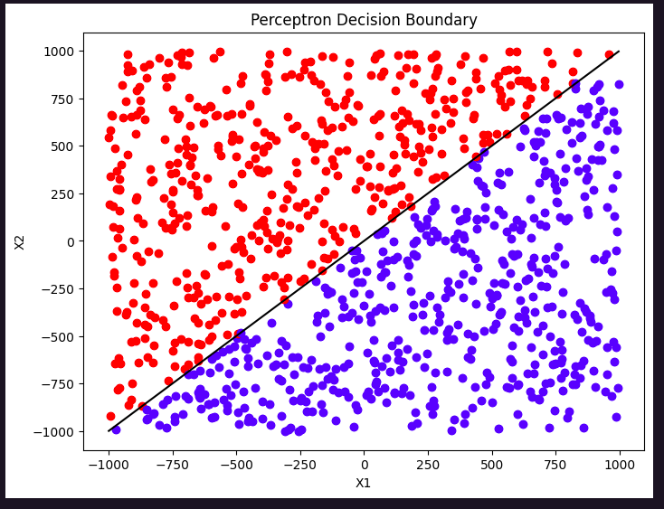
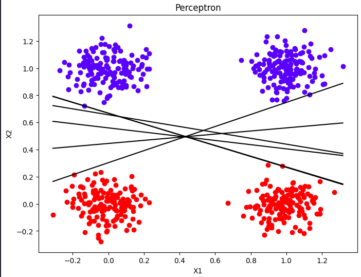
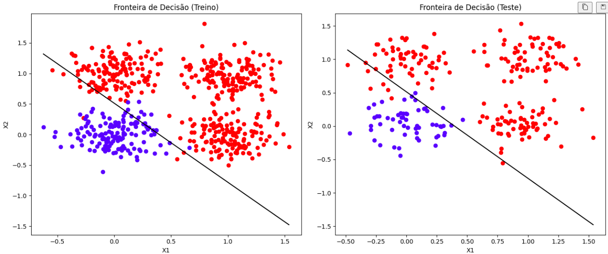

# PerceptronNeuralNetwork

Atividade experimentação do comportamento de um Perceptron para Problemas Linearmente Separáveis e Problemas Não-Linearmente Separáveis

## Casos analisados

## Problema Linearmente Separável

## Experimentação com Problema Linearmente Separável

## Problema Não-Linearmente Separável

### Equipe
- Gustavo Lima
- Ian Marcony
- Lucas Teles
- Paulo Ricardo